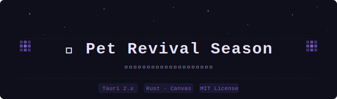

<div align="center">



<br/>

[](https://tauri.app)
[](https://www.rust-lang.org)
[](./LICENSE)
[]()

</div>

---

## 为什么做这个

你小时候的电脑桌面上，大概率有过一只小企鹅。

它会饿、会生病、会打工、会发呆、会在你不理它的时候自己写日记。你喂它的时候它开心，你忘记它的时候它默默等。它什么都不会说，但你觉得它在陪你。

后来它没了。2018 年腾讯关了服务器，那只企鹅连同几百万人的童年一起被存档封存。

这个项目想做的事很简单：**把那种「桌面上有个小东西在过自己的生活」的感觉，用现代技术重新做出来。**

不是怀旧模拟器，不是数值养成游戏。就是一个轻量的桌面挂件，它活着，你看着，偶尔互动一下。

---

## 它应该是什么感觉

```
它有自己的节奏，不是在等你点它

你没管它的时候 ——   在发呆、溜达、打哈欠、看窗外
你回来了 ——         它看你一眼
你拖它走 ——         它不太高兴
你喂它 ——           它开心
深夜了 ——           它趴着睡了
你长时间没碰电脑 ——  它叹口气，自己趴下
```

> 这些小动作，比任何数值面板都更能让你觉得：**它是活的。**

---

## 技术选型

| 层 | 选型 | 说明 |
|---|---|---|
| 框架 | **Tauri 2.x** | 轻量，适合常驻后台，资源占用 < 50MB |
| 状态机 | **Rust 行为树** | MVP 阶段用事件调度器，二期再精 |
| 渲染 | **Canvas / HTML** | 前端动画层，帧序列播放 |
| 核心设计 | **意图层与动画层解耦** | 后端产行为指令，前端选帧序列播放 |

---

## 快速开始

```bash
# 克隆项目
git clone https://github.com/yourname/pet-revival-season.git
cd pet-revival-season

# 安装依赖
npm install

# 开发模式启动
npm run tauri dev
```

> **环境要求：** Node.js 18+、Rust 1.70+、[Tauri 前置依赖](https://tauri.app/start/prerequisites/)

---

## 文档

| 文档 | 内容 |
|---|---|
| [`docs/architecture.md`](docs/architecture.md) | 技术架构、目录结构、意图层设计 |
| [`docs/mvp.md`](docs/mvp.md) | MVP 范围、行为优先级、完成标准 |

---

## 项目名的由来

当年 QQ 宠物关服的时候，很多人说「它死了」。

但**复活赛**这个词的意思是：被淘汰的人还有机会回来。

这个项目就是一场复活赛。我们不一定能赢，但至少可以试试。

---

<div align="center">
<sub>made with 🫶 and a lot of nostalgia</sub>
</div>
